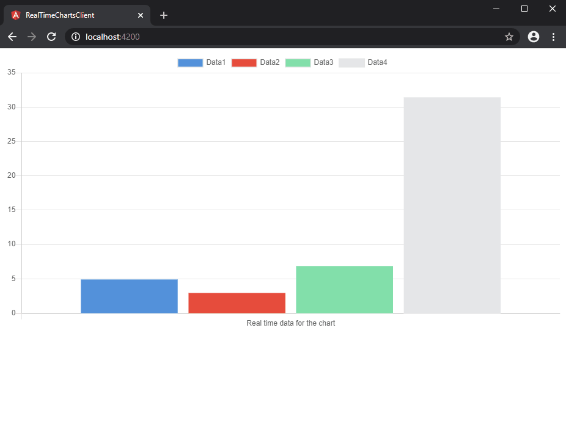

# SignalRAngularRealTimeCharts
Angular 7 and NET Core with SignalR to show real time charts.

## Getting Started

1. Clone the project.
2. Open RealTimeCharts_Server solution file with Visual Studio and compile the application.
3. Open RealTimeChartsClient and run _npm install -g @angular/cli_ and then _npm install_ command.

## Running the app

1. Run RealTimeCharts_Server application (F5 on Visual Studio).
2. Run _ng serve_ on RealTimeChartsClient.

## Built With

* [NET Core](https://dotnet.microsoft.com/) -  Cross-platform, Open source platform for building apps.
* [Angular](https://angular.io/) - Platform for building mobile and desktop web applications
* [SignalR](https://dotnet.microsoft.com/apps/aspnet/signalr) - Incredibly simple real-time web for .NET Apps

## Authors

* **Luis Barral** - *All work* - [Barralex](https://github.com/Barralex)

## License

This project is licensed under the MIT License
